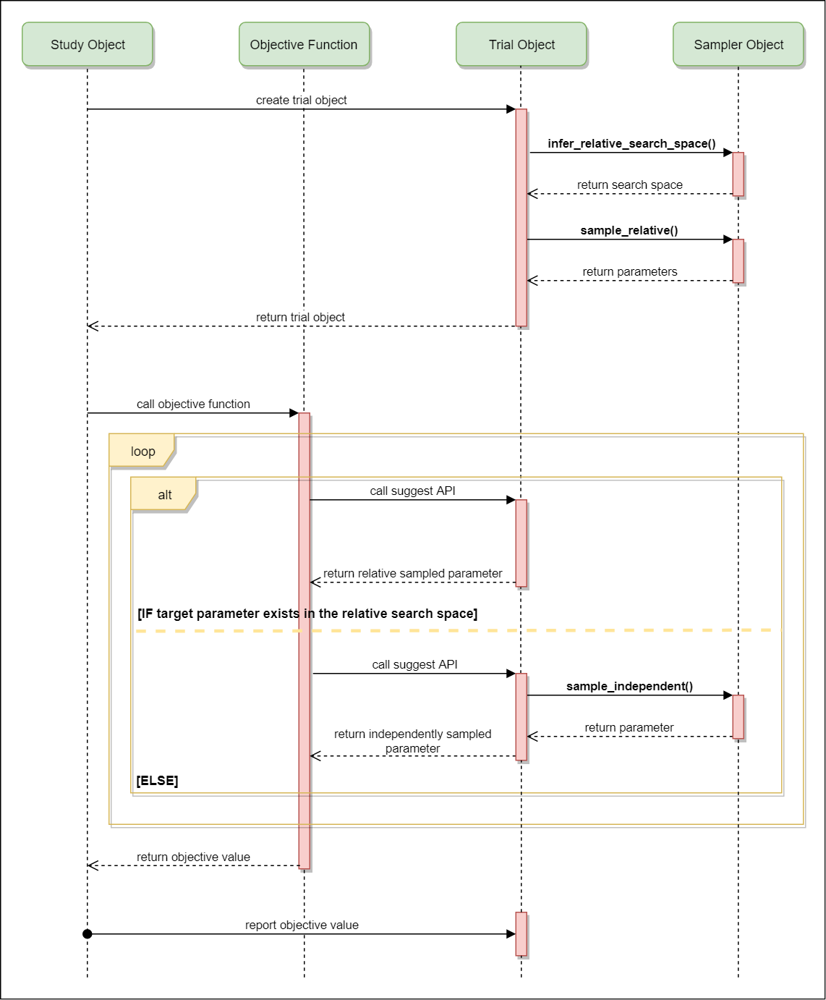

.. _sampler:

Custom Sampler
==============

This feature enables you to define your samplers.

A sampler has the responsibility to determine the parameter values to be evaluated in a trial.
When a `suggest` API (e.g., :func:`~optuna.trial.Trial.suggest_uniform`) is called inside an objective function, the corresponding distribution object (e.g., :class:`~optuna.distributions.UniformDistribution`) is created internally. A sampler samples a value from the distribution. The sampled value is returned to the caller of the `suggest` API and evaluated in the objective function.

Optuna provides built-in samplers (e.g., :class:`~optuna.samplers.TPESampler`, :class:`~optuna.samplers.RandomSampler`) that work well for a wide range of cases.
However, if you are only interested in optimizing hyperparameters in a specific domain, optimization performance may be improved if you use a sampling algorithm specialized to the domain.
Thanks to custom sampler feature, you can use such specialized algorithms within the Optuna framework.

In addition, this feature allows you to use algorithms implemented by other libraries.
For instance, Optuna provides :class:`~optuna.integration.SkoptSampler` that wraps
`skopt <https://scikit-optimize.github.io/>`_ library.

An example: Implementing SimulatedAnnealingSampler
--------------------------------------------------

In this section, let's implement a sampler based on
`Simulate Annealing (SA) <https://en.wikipedia.org/wiki/Simulated_annealing>`_ algorithm.

.. note::
   For simplicity, the following implementation doesn't support some features (e.g., maximization).
   If you are interested, more completed version is found in
   `simulated_annealing.py <https://github.com/pfnet/optuna/tree/master/examples/sampler/simulated_annealing.py>`_
   example.

First, you need to define a class that inherits :class:`~optuna.samplers.BaseSampler`.
In the constructor of ``SimulatedAnnealingSampler``, the temperature and state of SA are initialized.

.. code-block:: python

    import numpy as np
    import optuna

    class SimulatedAnnealingSampler(optuna.samplers.BaseSampler):
        def __init__(self, temperature=100, seed=None):
            # type: (int, Optional[int]) -> None

            self._rng = np.random.RandomState(seed)
            self._temperature = temperature  # Current temperature.
            self._current_params = {}  # Current state (parameter names and values).

Then, let's define :meth:`~optuna.samplers.BaseSampler.sample_relative` method.
:meth:`~optuna.samplers.BaseSampler.sample_relative` is called at the beginning of a trial for sampling parameters from the given search space (i.e., distributions).
The following code is the core part of this sampler.

.. code-block:: python

    ...

        def sample_relative(self, study, trial, search_space):
            # type: (InTrialStudy, FrozenTrial, Dict[str, BaseDistribution]) -> Dict[str, Any]

            if search_space == {}:
                return {}

            # Calculate transition probability.
            prev_trial = study.trials[-2]
            best_trial = study.best_trial
            if prev_trial.value <= best_trial.value:
                probability = 1.0
            else:
                probability = np.exp((best_trial.value - prev_trial.value) / self._temperature)
            self._temperature *= 0.9  # Decrease temperature.

            # Transit the current state if the previous result is accepted.
            if self._rng.uniform(0, 1) < probability:
                self._current_params = prev_trial.params

            # Sample parameters for the trial.
            params = {}
            for param_name, param_distribution in search_space.items():
                if not isinstance(param_distribution, optuna.distributions.UniformDistribution):
                    raise NotImplementedError('Only suggest_uniform() is supported')

                current_value = self._current_params[param_name]
                width = (param_distribution.high - param_distribution.low) * 0.1
                neighbor_low = max(current_value - width, param_distribution.low)
                neighbor_high = min(current_value + width, param_distribution.high)
                params[param_name] = self._rng.uniform(neighbor_low, neighbor_high)

            return params

Finally, it's needed to implement other abstract methods of :class:`~optuna.samplers.BaseSampler` as the following code.
About the details of those methods, please read the next section.

.. code-block:: python

    ...

        def infer_relative_search_space(self, study, trial):
            # type: (InTrialStudy, FrozenTrial) -> Dict[str, BaseDistribution]

            return optuna.samplers.product_search_space(study)

        def sample_independent(self, study, trial, param_name, param_distribution):
            # type: (InTrialStudy, FrozenTrial, str, BaseDistribution) -> Any

            independent_sampler = optuna.samplers.RandomSampler()
            return independent_sampler.sample_independent(study, trial, param_name, param_distribution)

``SimulatedAnnealingSampler`` is complete.
The custom sampler can be used in the same way as built-in samplers (see below).

.. code-block:: python

    def objective(trial):
        x = trial.suggest_uniform('x', -10, 10)
        return x ** 2

    sampler = SimulatedAnnealingSampler()
    study = optuna.create_study(sampler=sampler)
    study.optimize(objective, n_trials=100)

Details of :class:`~optuna.samplers.BaseSampler`
------------------------------------------------

All samplers have to inherit :class:`~optuna.samplers.BaseSampler`.
This base class defines the following abstract methods:

- :meth:`~optuna.samplers.BaseSampler.infer_relative_search_space`
- :meth:`~optuna.samplers.BaseSampler.sample_relative`
- :meth:`~optuna.samplers.BaseSampler.sample_independent`

As the method names implies, Optuna supports two type of samplings; one is **relative sampling** that can consider the correlation of the parameters in a trial, and another is **independent sampling** that samples each parameter independently.

At the beggining of a trial, :meth:`~optuna.samplers.BaseSampler.infer_relative_search_space` is called for determining the relative search space passed to :meth:`~optuna.samplers.BaseSampler.sample_relative`. Then, :meth:`~optuna.samplers.BaseSampler.sample_relative` is invoked for sampling relative parameters for the trial. During the execution of the objective function, :meth:`~optuna.samplers.BaseSampler.sample_independent` is used for sampling parameters that don't belong to the relative search space.

The following picture depicts the lifetime of a trial and the relationship of the above methods.

How to infer relative search space
----------------------------------

Optuna features ``define-by-run`` style API, so parameter search space may change from trial to trial.
It is the responsibility of :meth:`~optuna.samplers.BaseSampler.infer_relative_search_space` to ... for ... .

There is a convenient built-in function :func:`~optuna.samplers.product_search_space`.
By using this function, you can get the search space that only contains parameters belong to all the previous trials in a study.

One limitation of :func:`~optuna.samplers.product_search_space` is it doesn't work well with objective functions that use highly conditional search space.

For example, the following objective function doesn't contains conditional expression, so all the parameters are included in the result of :func:`~optuna.samplers.product_search_space`:

.. code-block:: python

    def objective(trial):
        x = trial.suggest_uniform('x', -10, 10)
        y = trial.suggest_uniform('y', -10, 10)
        z = trial.suggest_uniform('z', -10, 10)
        return x + y + z

    study = optuna.create_study(objective, n_trials=100)
    assert set(optuna.samplers.product_search_space(study).keys()) == {'x', 'y', 'z'}

However, if an objective function, like below, that contains conditional expressions is used, parameters that suggested in the conditional expressions are omitted from the result of :func:`~optuna.samplers.product_search_space`. So those parameters (``y`` and ``z`` in the following code) will be sampled by using :meth:`~optuna.samplers.BaseSampler.sample_independent` instead of :meth:`~optuna.samplers.BaseSampler.sample_relative`.

.. code-block:: python

    def objective(trial):
        x = trial.suggest_uniform('x', -10, 10)
        category = trial.suggest_categorical('category', ['y', 'z'])
        if category == 'y':
            y = trial.suggest_uniform('y', -10, 10)
            return x + y
        else:
            z = trial.suggest_uniform('z', -10, 10)
            return x + z

    study = optuna.create_study(objective, n_trials=100)
    assert set(optuna.samplers.product_search_space(study).keys()) == {'x', 'category'}

TODO: nanikakaku
